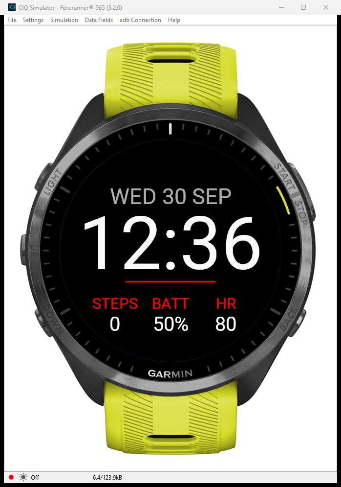

# Garmin Watch Face Starter

A working Garmin watch face you can turn into anything, with AI doing the coding.

It shows the date, the time, steps, battery and heart rate, with an accent colour you
can change from the Connect IQ phone app. Every line is commented in plain English, and
`CLAUDE.md` tells Claude exactly how to build and change it.

## Quick start

1. Install **VS Code**, the **Garmin Connect IQ SDK**, the **Monkey C** extension and
   **Claude Code** (the full guide walks you through every click).
2. Click the green **Code** button above → **Download ZIP**, and unzip it somewhere easy
   like `Documents\my-watch-face`.
3. In VS Code: **File → Open Folder** → pick that folder.
4. Command Palette (`Ctrl+Shift+P`) → **Monkey C: Generate a Developer Key**.
5. Press **F5**, pick your watch. The simulator opens with your watch face on it.
6. Open Claude Code and tell it what you want: *"Make the time orange and add the sunrise time under it."*

## Want live data from the internet?

Surf, weather, the footy score: that needs a background service. See the full working
example: **[SwellVision](https://github.com/aaronparton2-sketch/swellvision)**, my surf
watch face (free on the [Connect IQ Store](https://apps.garmin.com/en-US/apps/5859e191-2af1-4b10-b913-388b09a9985f)).

## Files

| File | What it does |
|---|---|
| `source/StarterView.mc` | Everything drawn on the screen |
| `source/StarterApp.mc` | The entry point |
| `manifest.xml` | App ID, supported watches, permissions |
| `resources/` | Name, settings, icon |
| `CLAUDE.md` | Instructions for Claude |

🔴 Never upload your `developer_key.der` anywhere. It signs your watch face. It's already
in `.gitignore`.

Made by [Aaron Parton](https://www.youtube.com/@aaron-parton) · Mycelium AI · MIT licence
